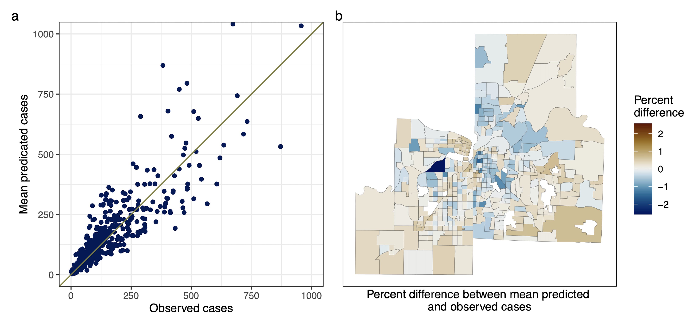

# Data Visualization

These scripts produce data visualizations, including descriptive plots, mapping of spatial distributions, and plots for evaluating and interpreting model output. The following R packages are used:

- `bayesplot` for visualizing the Bayesian models created using `brms`
- `scico` for perceptually uniform and colorblind safe color palettes
- `tidybayes` for incorporating Bayesian models in a tidydata workflow
- `patchwork` for combining separate ggplots
- `sf` for working with spatial vector data
- `here` for easy file referencing

## Click on an image to see the code that produced the data visualization.

|                                                  |                                                  |
|:---:                                             |:---:                                             |
|    |    |
|  |  |
|    |    |
|    | &nbsp;&nbsp;&nbsp;&nbsp;&nbsp;&nbsp;&nbsp;&nbsp;&nbsp;&nbsp;&nbsp;&nbsp;&nbsp;&nbsp;&nbsp;&nbsp;&nbsp;&nbsp;&nbsp;&nbsp;&nbsp;&nbsp;&nbsp;&nbsp;&nbsp;&nbsp;&nbsp;&nbsp;&nbsp;&nbsp;&nbsp;&nbsp;&nbsp;&nbsp;&nbsp;&nbsp;&nbsp;&nbsp;&nbsp;&nbsp;&nbsp;&nbsp;&nbsp;&nbsp;&nbsp;&nbsp;&nbsp;&nbsp;&nbsp;|

